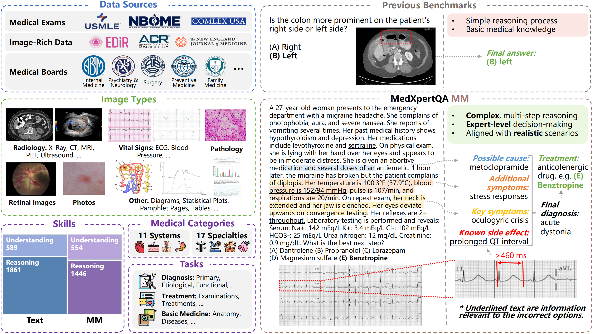
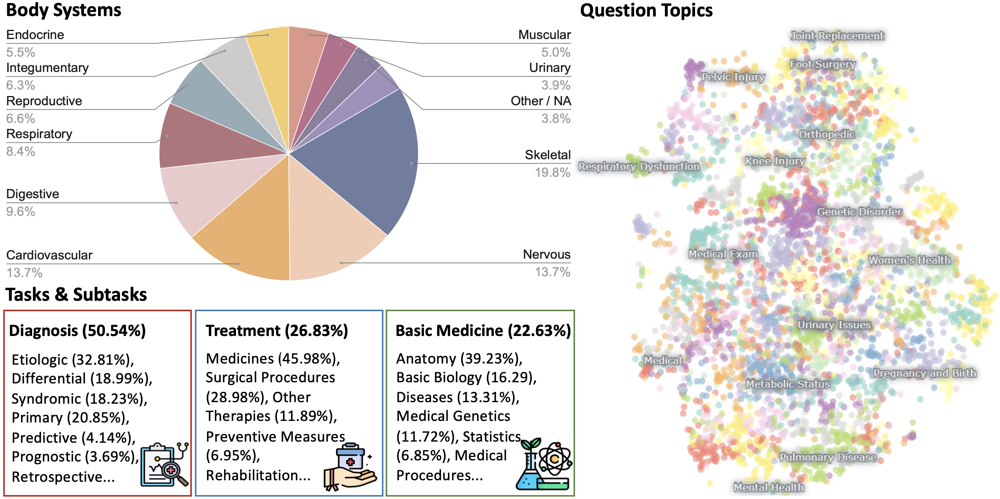
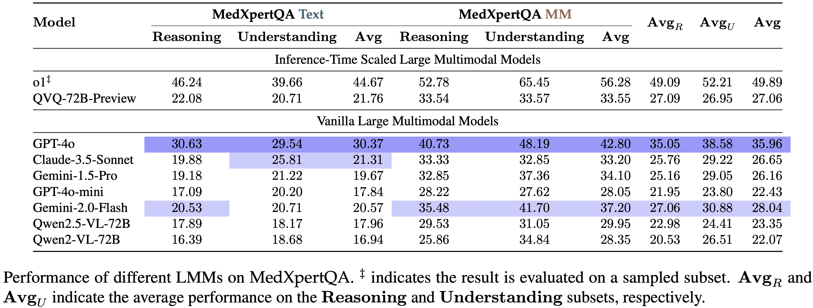
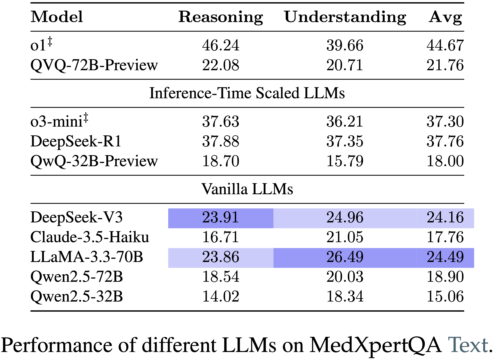

<div align="center">
# MedXpertQA: Benchmarking Expert-Level Medical Reasoning and Understanding

[](https://arxiv.org/abs/2501.18362)  [](https://huggingface.co/datasets/TsinghuaC3I/MedXpertQA)  [](https://medxpertqa.github.io)  [](https://github.com/TsinghuaC3I/MedXpertQA/blob/main/LICENSE)

</div>

<div align="center">
  <p>
    <a href="#news" style="text-decoration: none; font-weight: bold;">🔥 News</a> •
    <a href="#overview" style="text-decoration: none; font-weight: bold;">📖 Overview</a> •
    <a href="#features" style="text-decoration: none; font-weight: bold;">✨ Features</a> •
    <a href="#leaderboard" style="text-decoration: none; font-weight: bold;">📊 Leaderboard</a>
  </p>
  <p>
    <a href="#usage" style="text-decoration: none; font-weight: bold;">🔧 Usage</a> •
    <a href="#contact" style="text-decoration: none; font-weight: bold;">📨 Contact</a> •
    <a href="#citation" style="text-decoration: none; font-weight: bold;">🎈 Citation</a>
  </p>
</div>

## 🔥News

- **🎉 [2025-05-06] MedXpertQA paper is accepted to [ICML 2025](https://icml.cc/Conferences/2025)!**
- **🛠️ [2025-04-08] MedXpertQA has been successfully integrated into [OpenCompass](https://github.com/open-compass/opencompass)! Check out the [PR](https://github.com/open-compass/opencompass/pull/2002)!**
- **💻 [2025-02-28] We release the evaluation code! Check out the [Usage](#usage).**
- **🌟 [2025-02-20] [Leaderboard](https://medxpertqa.github.io) is on! Check out the results of o3-mini, DeepSeek-R1, and o1!**
- **🤗 [2025-02-09] We release the MedXpertQA [dataset](https://huggingface.co/datasets/TsinghuaC3I/MedXpertQA).**
- **🔥 [2025-01-31] We introduce [MedXpertQA](https://arxiv.org/abs/2501.18362), a highly challenging and comprehensive benchmark to evaluate expert-level medical knowledge and advanced reasoning!**

## 📖Overview

**MedXpertQA** includes 4,460 questions spanning 17 specialties and 11 body systems. It includes two subsets, **MedXpertQA Text** for text medical evaluation and **MedXpertQA MM** for multimodal medical evaluation. The following figure presents an overview.
<details>
<summary>
  More Details
</summary>
The left side illustrates the diverse data sources, image types, and question attributes.
The right side compares typical examples from MedXpertQA MM and a traditional benchmark (VQA-RAD).
</details>

<p align="center">
   
</p>


## ✨Features

- **Next-Generation Multimodal Medical Evaluation:** MedXpertQA MM introduces expert-level medical exam questions with diverse images and rich clinical information, including patient records and examination results, setting it apart from traditional medical multimodal benchmarks with simple QA pairs generated from image captions.
- **Highly Challenging:** MedXpertQA introduces high-difficulty medical exam questions and applies rigorous filtering and augmentation, effectively addressing the insufficient difficulty of existing benchmarks like MedQA. The Text and MM subsets are currently the most challenging benchmarks in their respective fields.
- **Clinical Relevance:**  MedXpertQA incorporates specialty board questions to improve clinical relevance and comprehensiveness by collecting questions corresponding to 17/25 member board exams (specialties) of the American Board of Medical Specialties. It showcases remarkable diversity across multiple dimensions.

<p align="center">
   
</p>
# This is fork of MedXpertQA
- **Mitigating Data Leakage:** We perform data synthesis to mitigate data leakage risk and conduct multiple rounds of expert reviews to ensure accuracy and reliability.
- **Reasoning-Oriented Evaluation:** Medicine provides a rich and representative setting for assessing reasoning abilities beyond mathematics and code. We develop a reasoning-oriented subset to facilitate the assessment of o1-like models.

## 📊Leaderboard

We evaluate 17 leading proprietary and open-source LMMs and LLMs including advanced inference-time scaled models with a focus on the latest progress in medical reasoning capabilities.
**Further details are available in the [leaderboard](https://medxpertqa.github.io) and the [paper](https://arxiv.org/abs/2501.18362).**

<p align="center">
  
  
</p>


## 🔧Usage

1. Clone the Repository:

```
git clone https://github.com/AIEpisteme/MedXpertQA-HF
cd MedXpertQA/eval
```

2. Install Dependencies:

```
pip3 install -r requirements.txt
```

For Hugging Face local or remote model inference:

```
pip3 install -r requirements-hf.txt
```

If the model is gated or private, set a Hugging Face token in the environment. The runner reads `HF_TOKEN` or `HUGGING_FACE_HUB_TOKEN`; do not hardcode tokens in source files.

3. Hugging Face Text Inference:

From the `eval` directory, run a text-only model such as `EpistemeAI/Reasoning-Medical-27B` on the text split:

```
python main.py --provider hf --model EpistemeAI/Reasoning-Medical-27B --dataset medxpertqa_sampled --task text --method zero_shot --prompting-type cot --output-dir hf-dev --max-samples 5 --num-threads 1 --hf-device-map auto --hf-torch-dtype auto --hf-max-new-tokens 4096
```

Or use the helper script:

```
bash scripts/run_hf.sh EpistemeAI/Reasoning-Medical-27B medxpertqa_sampled text hf-dev zero_shot cot 5 4096
```

Notes:

- `Reasoning-Medical-27B` is expected to require substantial GPU memory. Use a smaller Hugging Face causal LM first for smoke testing if needed.
- The generic Hugging Face agent is text-only. For MedXpertQA MM/image tasks, use a multimodal integration. `--hf-image-policy describe` or `ignore` exists only for non-benchmark smoke tests and should not be used for valid MM scoring.
- `--hf-trust-remote-code` is available for models that require custom code. Review the model repository before enabling it.

4. API Inference:

```
bash scripts/run.sh
```

> The *run.sh* script performs inference by calling *main.py*, which offers additional features such as multithreading. Additionally, you can modify *model/api_agent.py* to support more models.

5. Evaluation:

We provide a script *eval.ipynb* to calculate accuracy on each subset.

> [!NOTE]
> Please use this script when evaluating the **QVQ** and **DeepSeek-R1**. Through case studies, we found that the answer cleaning function in the *utils.py* is unsuitable for these two models.

## 📨Contact

- Shang Qu: [lindsay2864tt@gmail.com](mailto:lindsay2864tt@gmail.com)

- Ning Ding: [dn97@mail.tsinghua.edu.cn](mailto:dn97@mail.tsinghua.edu.cn)

## ⚖️License

This repository retains its Apache-2.0 `LICENSE` for repository-specific work.
The imported upstream MedXpertQA source is MIT-licensed; see `LICENSE-MedXpertQA`
and the original [TsinghuaC3I/MedXpertQA license](https://github.com/TsinghuaC3I/MedXpertQA/blob/main/LICENSE).

## 🎈Citation

If you find our work helpful, please use the following citation.

```bibtex
@article{zuo2025medxpertqa,
  title={Medxpertqa: Benchmarking expert-level medical reasoning and understanding},
  author={Zuo, Yuxin and Qu, Shang and Li, Yifei and Chen, Zhangren and Zhu, Xuekai and Hua, Ermo and Zhang, Kaiyan and Ding, Ning and Zhou, Bowen},
  journal={arXiv preprint arXiv:2501.18362},
  year={2025}
}
```
